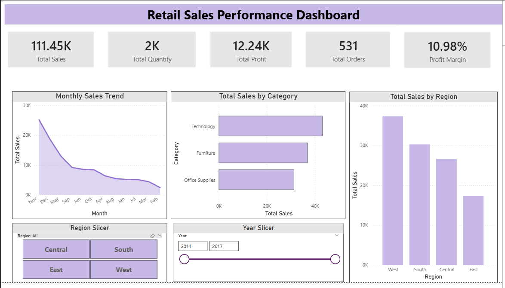
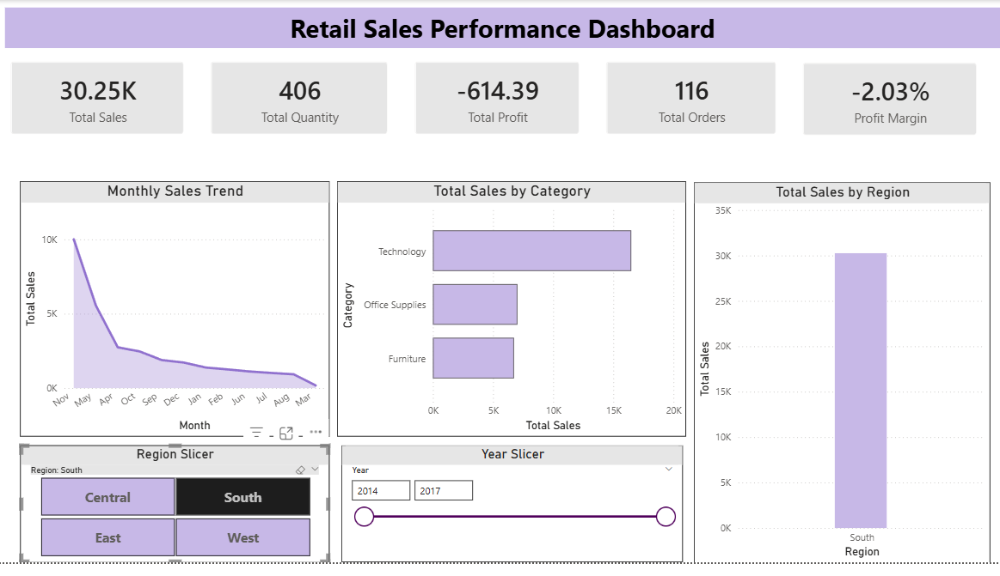

# 📊 Retail Sales Performance Dashboard | Power BI


---

# 📌 Project Overview

The **Retail Sales Performance Dashboard** is an interactive Business Intelligence solution developed using **Microsoft Power BI**.

The purpose of this project is to transform raw retail transaction data into meaningful business insights through data modelling, DAX calculations, KPI development, and interactive visualizations.

The dashboard enables decision-makers to analyze:

- Sales performance
- Profitability
- Order trends
- Product category performance
- Regional sales performance
- Time-based sales patterns

---

# 🎯 Project Objective

The main objective of this project is to design an interactive dashboard that helps businesses understand their sales performance and make data-driven decisions.

The dashboard answers key business questions:

- What is the overall sales revenue?
- How profitable is the business?
- Which product categories generate the highest sales?
- Which regions contribute the most revenue?
- How does sales performance change over time?
- How do different years and regions impact business performance?

---

# 📂 Dataset Information

## Dataset Name

**Sample Superstore Dataset**

## Dataset Type

Retail Transactional Sales Data

## Dataset Description

The dataset contains historical retail sales transactions including customer details, product information, sales values, discounts, and profitability.

### Main Attributes

| Column | Description |
|---|---|
| Order ID | Unique order identifier |
| Order Date | Date when order was placed |
| Customer Name | Customer information |
| Segment | Customer segment |
| Region | Sales region |
| Category | Product category |
| Sub Category | Product sub-category |
| Sales | Revenue generated |
| Quantity | Number of products sold |
| Discount | Discount applied |
| Profit | Profit generated |

---

# 🛠️ Tools & Technologies Used

| Tool | Purpose |
|-|-|
| Microsoft Power BI | Dashboard development |
| Power Query | Data cleaning and transformation |
| DAX | KPI and business calculations |
| GitHub | Version control and project documentation |

---

# 🔄 Data Preparation

The dataset was prepared using Power Query.

The following transformations were performed:

- Verified and corrected data types
- Formatted date fields
- Checked numerical columns
- Prepared data for analysis
- Created a dedicated Date Table

---

# 🗂️ Data Model

A star-schema style data model was created by connecting the Date Table with the sales transaction table.

Relationship:

```
Date Table
     |
     | 1 : *
     |
Sample - Superstore
```

The Date Table contains:

- Date
- Year
- Month
- Month Number

This allows accurate:

- Monthly analysis
- Year filtering
- Time-based reporting

---

# 🧮 DAX Measures Created

## Total Sales

```DAX
Total Sales =
SUM('Sample - Superstore'[Sales])
```

---

## Total Profit

```DAX
Total Profit =
SUM('Sample - Superstore'[Profit])
```

---

## Total Orders

```DAX
Total Orders =
DISTINCTCOUNT('Sample - Superstore'[Order ID])
```

---

## Total Quantity

```DAX
Total Quantity =
SUM('Sample - Superstore'[Quantity])
```

---

## Profit Margin

```DAX
Profit Margin =
DIVIDE(
    [Total Profit],
    [Total Sales],
    0
)
```

---

# 📊 Dashboard KPIs

The dashboard contains five major business KPIs:

| KPI | Purpose |
|-|-|
| Total Sales | Measures total revenue |
| Total Quantity | Shows total products sold |
| Total Profit | Measures business profitability |
| Total Orders | Counts completed orders |
| Profit Margin | Measures profitability percentage |

---

# 📈 Dashboard Visualizations

## 1. Monthly Sales Trend

**Visual Type:** Line Chart

Purpose:

- Identify monthly sales patterns
- Understand sales fluctuations
- Analyze seasonal trends


---

## 2. Sales by Category

**Visual Type:** Bar Chart

Categories analyzed:

- Technology
- Furniture
- Office Supplies


Purpose:

- Identify high-performing product categories
- Compare category revenue contribution


---

## 3. Sales by Region

**Visual Type:** Column Chart

Regions analyzed:

- West
- South
- Central
- East


Purpose:

- Compare regional performance
- Identify strong and weak markets

---

# 🎛️ Interactive Features

The dashboard includes interactive slicers:

## Year Filter

Allows users to analyze performance across different years.

## Region Filter

Allows comparison of:

- Central
- South
- East
- West

All dashboard visuals automatically update based on selected filters.

---

# 🖥️ Dashboard Screenshots

## Complete Dashboard View




---

## Filtered Dashboard Analysis - Region Selection




---

## Filtered Dashboard Analysis - Year Selection


---

# 💡 Business Insights

Based on the dashboard analysis:

### 1. Category Performance

Technology products generate the highest sales contribution, showing strong customer demand compared with other categories.

### 2. Regional Performance

The West region demonstrates the strongest sales performance, followed by South, Central, and East regions.

### 3. Profitability Analysis

The business achieves an overall positive profit margin, indicating effective revenue generation.

### 4. Importance of Filtering

Interactive filtering reveals that performance varies significantly depending on selected years and regions.

### 5. Sales vs Profit Relationship

High sales volume does not always guarantee higher profitability; discount levels and product performance influence final profit.

---

# 📁 Repository Structure

```
PowerBI-Retail-Sales-Dashboard
│
├── Dataset
│   └── Sample - Superstore.csv
│
├── PowerBI
│   └── Retail_Sales_Performance_Dashboard.pbix
│
├── Images
│   ├── Screenshot 2026-09-09 180910.png
│   ├── Screenshot 2026-09-09 180923.png
│   └── Screenshot 2026-09-09 180940.png
│
├── Report
│   └── Project_Report.md
│
└── README.md
```

---

# ▶️ How to Use

1. Download or clone this repository.

2. Open:

```
PowerBI/Retail_Sales_Performance_Dashboard.pbix
```

using Microsoft Power BI Desktop.

3. Use slicers to interact with:

- Year
- Region

4. Explore different sales and profitability insights.

---

# 🚀 Future Improvements

Possible enhancements:

- Customer segmentation analysis
- Top 10 product analysis
- Profit vs discount analysis
- Sales forecasting
- Year-over-year growth analysis
- Advanced drill-through reports

---

# 👤 Author

Developed as an individual **Business Intelligence and Data Visualization Project** using Microsoft Power BI.

Skills demonstrated:

- Power BI Dashboard Development
- Data Modelling
- DAX
- Power Query
- Data Visualization
- Business Analytics
- GitHub Documentation
